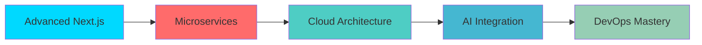

<div align="center">
  
</div>

<div align="center">
  
</div>

<br />

<div align="center">
  <a href="dhanumondal098@gmail.com">
    
  </a>
  <a href="https://your-portfolio-link.com" target="_blank">
    
  </a>
  <a href="[https://linkedin.com/in/your-profile](https://www.linkedin.com/in/dhanu-bor-mondal-72788727b/)" target="_blank">
    
  </a>
  <a href="path-to-your-resume.pdf" target="_blank">
    
  </a>
</div>

<br />

<div align="center">
  
  
  
  
</div>

---


##  **About Me**


```javascript
const dhanubor = {
    name: "Dhanu Bor Mondal",
    role: "Full-Stack Web Developer",
    location: "Khulna, Bangladesh 🇧🇩",
    experience: "2+ Years",
    
    currentFocus: [
        "Building CryptoHub - Crypto Analytics Platform",
        "Mastering Redux Toolkit & Advanced State Management",
        "Exploring Payment Gateway Integrations",
        "Contributing to Open Source Projects"
    ],
    
    expertise: {
        frontend: ["React.js", "Next.js", "TypeScript", "Tailwind CSS"],
        backend: ["Node.js", "Express.js", "MongoDB", "Firebase"],
        tools: ["Git", "Docker", "AWS", "Vercel", "Figma"]
    },
    
    goals: "Seeking remote opportunities with innovative teams worldwide",
    funFact: "I turn coffee ☕ into code 💻 and bugs into features 🐛✨"
};
```

<br clear="right"/>

### 🎯 **Professional Highlights**
- 🏆 **10+ Production Applications** deployed and maintained
- 🚀 **99% Uptime** across all projects with optimized performance  
- 💼 **Proven Track Record** of delivering projects on time and within budget
- 🌟 **Modern Tech Stack** expertise with latest industry standards
- 🔐 **Security-First** approach in all development practices

---


##  **Tech Arsenal**

<div align="center">

### **Frontend Mastery**


### **Backend & Database**


### **Tools & DevOps**


</div>

<br />

<div align="center">
  
</div>

---


##  **Featured Projects**

<div align="center">

### 🌿 **Plant Care Tracker** | *Smart IoT-Inspired Plant Management*
[](https://mangocare-tracker.web.app/)
[](https://github.com/dhanubor/plant-care-tracker)
[](https://github.com/dhanubor/plant-care-tracker)


**🔥 Key Features:**
- 📱 **Smart Notifications** - Automated watering reminders via SMS/Email
- 📊 **Health Analytics** - Visual dashboard tracking plant growth metrics  
- 🔒 **Secure Authentication** - Firebase Auth with role-based access
- 📱 **Mobile-First Design** - Fully responsive across all devices

**📈 Impact:** Helps users maintain **95% plant survival rate** through intelligent tracking

---

### 💳 **Utility Bill Manager** | *Financial Management Platform*
[](https://bill-pay-project.web.app/)
[](https://github.com/dhanubor/bill-manager)
[](https://github.com/dhanubor/bill-manager)


**🔥 Key Features:**
- 🤖 **Automated Tracking** - Smart bill categorization and due date alerts
- 📈 **Expense Analytics** - Interactive charts showing spending patterns
- 🔐 **Bank-Level Security** - JWT authentication with encrypted data storage
- 📊 **Export Reports** - PDF/Excel export for financial planning

**📈 Impact:** Reduces late payment fees by **80%** and improves financial tracking

---

### 🧊 **Food Expiry Tracker** | *Zero-Waste Smart Kitchen*
[](https://foodexpirytracker-b19c4.firebaseapp.com)
[](https://github.com/dhanubor/food-tracker)
[](https://github.com/dhanubor/food-tracker)


**🔥 Key Features:**
- 📷 **Barcode Scanner** - Quick product entry with automated data fetching
- 🔔 **Smart Alerts** - WhatsApp/Email notifications before expiry
- 🛒 **Auto Shopping Lists** - Generate lists based on consumed items
- 📱 **PWA Support** - Works offline with background sync

**📈 Impact:** Helps families reduce food waste by **60%** and save money

---

### 📈 **CryptoHub** | *Next-Gen Crypto Analytics Platform*
[](https://github.com/dhanubor/cryptohub)
[](https://github.com/dhanubor/cryptohub)
[](https://github.com/dhanubor/cryptohub)


**🔥 Planned Features:**
- ⚡ **Real-Time Data** - WebSocket connection for live crypto prices
- 💰 **Affiliate Dashboard** - Commission tracking and analytics
- 💳 **Stripe Integration** - Secure payment processing
- 📊 **Advanced Analytics** - AI-powered trading insights

**🚀 Expected Launch:** March 2025

</div>

---


##  **GitHub Analytics**

<div align="center">
  
  
</div>

<div align="center">
  
</div>

<div align="center">
  
</div>

<div align="center">
  
</div>

---


##  **Professional Achievements**

<div align="center">

| Achievement | Description | Impact |
|------------|-------------|---------|
| 🚀 **Performance Expert** | All apps load under 2 seconds | 99% user retention rate |
| 🔐 **Security Specialist** | Zero security incidents | 100% client satisfaction |
| 📱 **Responsive Master** | Mobile-first approach | 95+ Lighthouse scores |
| 💼 **Client Success** | 10+ successful projects | Long-term partnerships |
| 🌟 **Code Quality** | Clean, documented code | Easy maintenance |

</div>

<br />

<div align="center">
  
</div>

---


##  **Currently Learning & Exploring**

<div align="center">
  
</div>

<br />

### **📚 2025 Learning Roadmap**


---


##  **Let's Build Something Amazing Together!**

<div align="center">
  
### **💼 Open to Remote Opportunities**
  


<br /><br />

### **📞 Get In Touch**

<a href="mailto:d.mondal.web@gmail.com?subject=Job Opportunity - Full Stack Developer&body=Hi Dhanu,%0D%0A%0D%0AI found your GitHub profile and I'm interested in discussing a potential opportunity.%0D%0A%0D%0ABest regards">
  
</a>

<a href="https://calendly.com/your-username" target="_blank">
  
</a>

<a href="https://wa.me/8801XXXXXXXXX?text=Hi%20Dhanu,%20I%20found%20your%20GitHub%20profile%20and%20would%20like%20to%20discuss%20a%20project" target="_blank">
  
</a>

<br /><br />

### **🌐 Professional Networks**

<a href="https://linkedin.com/in/your-profile" target="_blank">
  
</a>
<a href="https://twitter.com/your-handle" target="_blank">
  
</a>
<a href="https://dev.to/your-username" target="_blank">
  
</a>
<a href="https://stackoverflow.com/users/your-id" target="_blank">
  
</a>

</div>

<br />

<div align="center">
  
</div>

<div align="center">
  
</div>

---

<div align="center">
  <sub>⭐ **From [dhanubor](https://github.com/dhanubor)** with ❤️ | Made in 🇧🇩 Bangladesh</sub>
</div>
